<div align="center">
  <h1>🔍 LingoLens</h1>
  <p><b>Translate the Web. Preserve the Design. Don't Break Stuff.™</b></p>
  <p><i>Because Google Translate turning a beautiful website into a crime scene isn't okay anymore.</i></p>

  <p>
    <a href="#-the-problem-we-all-pretend-doesnt-exist">The Problem</a> •
    <a href="#-our-fix-lingolens">The Fix</a> •
    <a href="#-features-the-fun-part">Features</a> •
    <a href="#-the-2x2-matrix-mode-the-showstopper">Matrix Mode</a> •
    <a href="#-article">Article</a> •
    <a href="#-demo-video">Demo Video</a> •
    <a href="#%EF%B8%8F-the-tech-stack-nerd-corner">Tech Stack</a> •
    <a href="#-architecture-overview">Architecture</a> •
    <a href="#-wanna-try-it">Try It</a>
  </p>
</div>

---

## 🎥 Demo Video

▶️ **Watch the full demo:**


https://github.com/user-attachments/assets/ad745a90-3978-4ad5-9873-260382558ad4


👉 **Stay till 3:11 to see Matrix Mode**, the most powerful feature of LingoLens.  
It shows the same website translated into four languages at once and makes layout issues instantly visible.

---

## 📖 Article

I wrote a detailed technical article explaining **why I built LingoLens**, the problems with existing translation tools, and how the system works under the hood.

👉 **Read the article:**  

<a href="https://dev.to/pavitra0/i-built-a-browser-inside-a-browser-and-it-translates-websites-without-breaking-a-single-pixel-4dk5">
    
  </a>


---

## 📸 Screenshots

<div align="center">

### Landing Page

*The homepage — clean, dark, and ready to proxy the entire internet.*

### Read Mode — Single Translation View

*A proxied website with live, layout-preserving translations. Click any text to translate it in-place.*

### 🔥 Matrix Mode — 2x2 Multi-Language Preview

*The same website in four languages simultaneously. Spanish, French, Japanese, Arabic — side by side. Your move, Google Translate.*

### AI Explain / Summarize Toolbar

*Select any text and get instant AI-powered explanations, summaries, or simplified versions.*

### Translation Panel & Library

*Every translation tracked, editable, lockable, and exportable. Your personal translation workspace.*

</div>

---

## 😤 The Problem We All Pretend Doesn't Exist

You find a gorgeous Japanese blog post. Beautiful typography. Stunning layout. Chef's kiss CSS.

Then you hit "Translate to English" and...

1. **💀 The UI dies.** German words are *long*. "Geschwindigkeitsbegrenzung" doesn't fit in a button meant for "Speed". Buttons overflow. Layouts collapse. Designers everywhere feel a disturbance in the force.
2. **🤷 Context? Never heard of her.** The translation says "he kicked the bucket" and now you think a man literally kicked a bucket. Idioms, cultural references, sarcasm — all murdered in cold blood by literal translation.
3. **😭 The vibes are ruined.** You came for the *experience* of a beautiful website. You got a wall of mangled text that looks like it was formatted by a microwave.

I've been there. I've suffered. It's time to stop.

---

## 🚀 The Fix: LingoLens

LingoLens is what happens when one developer asks: *"What if I could translate websites... without destroying them?"*

It's a **Translator Browser** — a proxy engine that loads any website in a sandboxed iframe, then lets you translate text **without touching a single pixel of the original layout**.

Click a paragraph? Translated. Hit the ✨ **Magic Wand**? Every visible element gets translated in one satisfying sweep. The CSS stays perfect. The fonts stay crisp. The designer who made that website can sleep peacefully tonight.

> **TL;DR:** I built Google Translate, but with *taste*.

---

## ✨ Features (The Fun Part)

### 🎨 Layout-Preserving Translation
Powered by [Lingo.dev](https://lingo.dev/), translations swap text in the DOM while respecting the original font weights, spacing, and CSS properties. There's even a **Layout Safety Inspector** that screams at you (politely, with a ⚠️ badge) if a translation causes overflow or wrapping issues.

> No layouts were harmed in the making of this translation.

### 🧠 AI-Powered "Explain This" (feat. Gemini)
Ever translate something and think *"...okay but what does that actually mean?"*

Select any text and the AI toolbar lets you:
- **✨ Explain** — Get a 2-line context-aware explanation powered by **Google Gemini 1.5 Flash**
- **📝 Summarize** — Too long, didn't translate
- **🧒 Simplify** — Explain it like I'm five
- **📖 Meaning** — Deep-dive into the meaning

The AI doesn't just translate — it *understands*. It reads the surrounding context of the article, the page title, and gives you an explanation that actually makes sense. It's like having a bilingual friend who also has a PhD.

### 🎯 Marquee Select Tool
Don't want to translate the whole page? Draw a rectangle over the area you want translated — like a screenshot tool, but for languages. Only the elements inside your selection get translated. Surgical precision.

### 💾 Save & Restore
Every translated page gets auto-saved to **IndexedDB** (not localStorage — we're not animals). Come back later, and your translations are restored exactly as you left them. Vocabulary gets saved with AI explanations attached.

### 🔊 Text-to-Speech
Click the 🔊 button and hear how the translated text actually sounds. Uses the Web Speech API with smart voice matching — it picks the best available voice for each language, prioritizing natural-sounding ones over the robotic defaults.

### 📦 Export to JSON
Working on an i18n project? Hit **Export JSON** and get a clean `{ "original": "translated" }` mapping. Instant localization files. Your product manager will think you're a wizard.

---

## 📐 The 2x2 Matrix Mode (The Showstopper)

Why translate into one language when you can do **four at once**?

Matrix Mode opens a **2x2 grid** of the same website — each quadrant translated into a **different language**, side by side, in real time.


**How it works:**
- The same proxied page is loaded in **4 separate iframes**
- Each pane has its own **language selector** — pick any of the 80+ supported languages
- Hit the ✨ **Magic Wand** and all four panes translate simultaneously
- Each pane scales the page to a virtual **1440px desktop viewport** using CSS transforms, so even in tiny quadrants they look like real full-width websites
- Every pane has a **Download JSON** button to export translations as i18n-ready files
- Click the **↗ External Link** icon to pop any pane into full Single Read Mode

> Spanish top-left, Japanese top-right, Arabic bottom-left, French bottom-right. 
> It's like the multiverse of languages, but for websites. And yes, I'm showing off.

This is the feature I built specifically to make judges go *"wait, that's actually really cool."*

---

## 🏗️ Architecture Overview

### System Flow

```mermaid
flowchart TD
    User(["👤 User"]) -->|Pastes URL| Landing["🏠 Landing Page"]
    Landing -->|Read Mode| ReadPage["📖 Read Mode\n/read/[url]"]
    Landing -->|Matrix Mode| MatrixPage["📐 Matrix Mode\n/matrix/[url]"]

    ReadPage -->|Loads iframe| Proxy["🌐 Proxy Engine\n/api/proxy"]
    MatrixPage -->|Loads 4 iframes| Proxy

    Proxy -->|Fetches & rewrites HTML| ExternalSite(["🌍 External Website"])
    Proxy -->|Injects| Script["💉 translation-script.js"]

    Script <-->|postMessage Bridge\n18 message types| ReactApp["⚛️ Next.js React App"]

    ReactApp -->|Server Actions| TranslateAPI["🔤 Lingo.dev API\n80+ Languages"]
    ReactApp -->|Server Actions| GeminiAPI["🤖 Gemini 1.5 Flash\nExplain / Summarize"]
    ReactApp -->|Server Actions| FirecrawlAPI["📄 Firecrawl\nMarkdown Extraction"]

    ReactApp -->|Saves/Restores| IDB[("💾 IndexedDB\nPages & Vocabulary")]
    ReactApp -->|Cache Layer| RQ["⚡ React Query\nstaleTime: 60s"]
    RQ --> IDB

    style Proxy fill:#1e293b,stroke:#60a5fa,color:#fff
    style Script fill:#1e293b,stroke:#f59e0b,color:#fff
    style ReactApp fill:#1e293b,stroke:#a78bfa,color:#fff
    style TranslateAPI fill:#0f172a,stroke:#34d399,color:#fff
    style GeminiAPI fill:#0f172a,stroke:#f472b6,color:#fff
    style FirecrawlAPI fill:#0f172a,stroke:#fb923c,color:#fff
```



### Proxy Engine Pipeline

```mermaid
flowchart LR
    A["🌍 Fetch External HTML"] --> B["🔍 Parse with Cheerio"]
    B --> C["✏️ Rewrite Asset URLs\n• stylesheets\n• scripts\n• images/srcset\n• CSS @import & url()"]
    C --> D["🛡️ Strip CSP Headers\n& X-Frame-Options"]
    D --> E["📌 Inject base href"]
    E --> F["💉 Inject\ntranslation-script.js"]
    F --> G["📤 Serve Rewritten HTML"]

    style A fill:#1e293b,stroke:#60a5fa,color:#fff
    style F fill:#1e293b,stroke:#f59e0b,color:#fff
    style G fill:#1e293b,stroke:#34d399,color:#fff
```



### PostMessage Bridge Protocol

```mermaid
sequenceDiagram
    participant R as ⚛️ React App
    participant I as 🖼️ Iframe (Proxied Site)

    Note over R,I: Click-to-Translate
    I->>R: TRANSLATE_REQUEST {id, text}
    R->>R: Call Lingo.dev API
    R->>I: TRANSLATION_RESULT {id, translated}

    Note over R,I: Magic Wand (Batch)
    R->>I: TRIGGER_BATCH_TRANSLATE
    I->>R: BATCH_TRANSLATE_REQUEST {elements[]}
    R->>R: Call Lingo.dev Batch API
    R->>I: BATCH_TRANSLATE_RESPONSE {results[]}

    Note over R,I: AI Toolbar
    I->>R: EXPLAIN_REQUEST {selectedText}
    R->>R: Call Gemini 1.5 Flash
    R->>R: Display explanation panel

    Note over R,I: Save & Restore
    R->>I: REQUEST_PAGE_STATE
    I->>R: PAGE_STATE_RESPONSE {translations}
    R->>R: Save to IndexedDB
    R->>I: RESTORE_PAGE_STATE {translations}
```



### Matrix Mode Architecture

```mermaid
flowchart TD
    subgraph Matrix["📐 Matrix Mode — 2×2 Grid"]
        direction TB
        subgraph Row1[" "]
            direction LR
            P1["🇪🇸 Spanish\niframe #1\nscale(0.45)"] --- P2["🇫🇷 French\niframe #2\nscale(0.45)"]
        end
        subgraph Row2[" "]
            direction LR
            P3["🇩🇪 German\niframe #3\nscale(0.45)"] --- P4["🇯🇵 Japanese\niframe #4\nscale(0.45)"]
        end
    end

    Proxy["🌐 Proxy Engine"] --> P1
    Proxy --> P2
    Proxy --> P3
    Proxy --> P4

    P1 & P2 & P3 & P4 -->|postMessage| App["⚛️ React App"]
    App -->|Translate| API["🔤 Lingo.dev API"]

    Note["Each pane:\n• Independent language selector\n• JSON export button\n• Open in Read Mode\n• Virtual 1440px viewport"] -.-> Matrix

    style P1 fill:#1e293b,stroke:#ef4444,color:#fff
    style P2 fill:#1e293b,stroke:#3b82f6,color:#fff
    style P3 fill:#1e293b,stroke:#eab308,color:#fff
    style P4 fill:#1e293b,stroke:#f472b6,color:#fff
    style Proxy fill:#0f172a,stroke:#60a5fa,color:#fff
```



---

## 🛠️ The Tech Stack (Nerd Corner)

| What | Why |
|------|-----|
| **Next.js 16** (App Router) | Because I like living on the bleeding edge |
| **TypeScript** | Because `any` is not a personality type |
| **[Lingo.dev](https://lingo.dev/) API** | The real translation muscle — fast, accurate, 80+ languages |
| **Google Gemini 1.5 Flash** | For the "Explain / Summarize / Simplify" AI magic |
| **Firecrawl** | Extracts clean markdown from any URL (for article mode) |
| **Cheerio** | Server-side HTML surgery for the proxy engine |
| **Tailwind CSS 4 + shadcn/ui** | Glassmorphism that would make Apple jealous |
| **TanStack React Query** | State management that doesn't make me cry |
| **IndexedDB** (via `idb`) | Client-side database for saved pages & vocabulary |
| **Web Speech API** | TTS that doesn't sound like a GPS from 2008 |
| **Zod** | Because runtime errors are for people who enjoy pain |

---

## 🔥 The "Hack": Yes, I Built a Browser Inside a Browser

*(Judges, this is the part where I hope you go "oh that's actually clever.")*

The hardest part wasn't the AI. It wasn't the translations. It was **proxying the modern web**.

Here's what I had to do:

1. **🌐 Build a full reverse proxy** — The `/api/proxy` route fetches any external website, parses the HTML with Cheerio, and rewrites *every single asset URL* (stylesheets, scripts, images, srcsets, CSS `@import`s, inline `url()`s) to route through my proxy. I also strip `Content-Security-Policy` headers and `X-Frame-Options` so the page actually loads in an iframe.

2. **🔌 Build a postMessage bridge** — The React app and the iframe live in different security contexts. They can't talk directly. So I built a full async message protocol with **18 different message types** — translate requests, batch operations, state snapshots, layout error reports, theme detection, and more. It's basically TCP but with `window.postMessage`.

3. **💉 Inject a translation runtime** — I inject `translation-script.js` into every proxied page. This 600+ line vanilla JS bundle handles hover detection, click-to-translate, batch processing, layout safety inspection, area selection (marquee tool), a floating AI toolbar, and state restore. All without a single npm dependency.

4. **📐 Scale 4 full-width websites into a 2×2 grid** — Matrix Mode renders four iframes at a virtual 1440px desktop width and uses `CSS transform: scale()` with `ResizeObserver` to shrink them into each grid quadrant. Each pane is independently language-selectable, translatable, and exportable. Building this felt like putting ships in bottles.

> I essentially built a browser inside a browser. Yo dawg, I heard you like browsers...

---

## 🏃 Wanna Try It?

1. **Clone it:**
   ```bash
   git clone https://github.com/your-repo/lingolens.git
   cd lingolens
   ```

2. **Install dependencies:**
   ```bash
   npm install
   ```

3. **Add your API keys** — Create a `.env.local` file:
   ```env
   LINGODOTDEV_API_KEY=your_lingo_dev_key
   GOOGLE_GENERATIVE_AI_API_KEY=your_gemini_key
   FIRECRAWL_API_KEY=your_firecrawl_key
   ```

4. **Start it up:**
   ```bash
   npm rundev
   ```

5. **Open** `http://localhost:3000`, paste any URL, and watch the magic happen ✨

---

## 🗂️ Project Structure (For the Curious)

```
app/
├── page.tsx                    # Landing page (the pretty one)
├── read/[...url]/page.tsx      # Single translation mode
├── matrix/[...url]/page.tsx    # 2x2 Matrix mode (the flex)
├── library/page.tsx            # Saved translations library
├── api/proxy/route.ts          # The reverse proxy engine
└── actions/                    # Server Actions (AI calls)
    ├── translate.ts            # Lingo.dev single translation
    ├── translateBatch.ts       # Lingo.dev batch translation
    ├── explain.ts              # Gemini — Explain
    ├── summarize.ts            # Gemini — Summarize
    ├── simplify.ts             # Gemini — Simplify
    ├── meaning.ts              # Gemini — Meaning
    ├── fetchContent.ts         # Firecrawl article extraction
    └── cleanMarkdown.ts        # Gemini — Markdown cleanup

components/
├── TranslationPanel.tsx        # The side panel with all the controls
├── LanguageSelector.tsx        # 80+ language picker
├── ArticleHeader.tsx           # Article metadata display
├── MDXRender.tsx               # Markdown renderer
└── ui/                         # shadcn/ui components

lib/
├── db.ts                       # IndexedDB setup
├── hooks/useLibrary.ts         # React Query hooks for persistence
├── languages.ts                # 80+ supported languages
├── tts.ts                      # Text-to-Speech engine
└── utils.ts                    # URL reconstruction & helpers

public/
└── translation-script.js       # The injected iframe runtime (the real MVP)
```

---

## 🧑‍💻 Built Solo

Yep — this whole thing was built by **one person**. No team. No division of labor. Just one sleep-deprived developer who thought *"how hard could it be to proxy the entire internet?"*

Spoiler: hard. Very hard. But I did it, and I had fun (mostly). The 2x2 Matrix Mode alone nearly broke me — scaling four full-width iframes into a responsive grid while keeping them all independently translatable is the kind of problem that sounds simple until you actually try it at 3 AM.

> If you're reading this, I survived. Barely. Send coffee.

---

## 📜 License

Built for the [Lingo.dev](https://lingo.dev/) Hackathon with ❤️, caffeine, and an unreasonable amount of `console.log` debugging.

---

<div align="center">
  <b>LingoLens</b> — <i>Translate the Web. Preserve the Design. Understand the Context.</i>
  <br />
  <br />
  ⭐ Star this repo if it made you smile (or if it saved your CSS from destruction)
</div>
